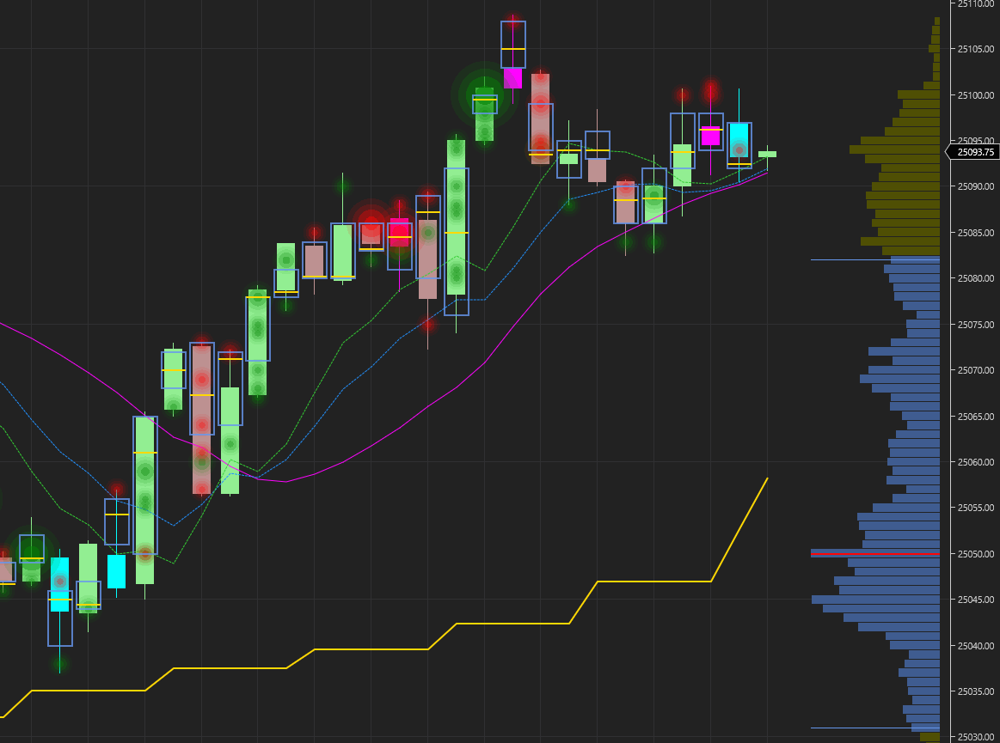

# BeerMoney Indicator

A NinjaTrader 8 indicator for order flow analysis with rolling window VWAP and volume profile, diagonal imbalances, and divergent bar detection. Easily identify imbalances on non-footprint charts.

## Requirements

- NinjaTrader 8
- **NinjaTrader OrderFlow+ package** (required for volumetric data access)
- Volumetric bars data feed (for order flow features)

## Features

### Multi-Timeframe VWAP Analysis

Two rolling VWAP lines calculated from configurable data series:

- **Bias VWAP** (Gold) - Slower VWAP with EMA smoothing for trend direction
- **Trigger VWAP** (Magenta) - Faster VWAP from volumetric bars for entry timing

The relationship between these VWAPs helps identify momentum and mean reversion opportunities.

### Diagonal Imbalance Detection

Highlights aggressive buying and selling activity using the standard footprint chart diagonal imbalance formula:

- **Bullish Imbalance** (Green glow) - Ask volume at price significantly exceeds Bid volume one level below
- **Bearish Imbalance** (Red glow) - Bid volume at price significantly exceeds Ask volume one level above

**Real-time updates**: Imbalances are calculated on each tick, so you can see them form and unform as the current bar develops.

Configurable settings:

- `Imbalance Ratio` - Minimum ratio threshold (default: 3.0 = 300%)
- `Min Difference` - Minimum volume difference between levels

### High Volume Imbalances

When an imbalance occurs at a price level with volume exceeding the threshold, the glow changes color and becomes 3x larger:

- **High Volume Bullish** (White glow) - Strong institutional buying
- **High Volume Bearish** (Orange glow) - Strong institutional selling

This helps identify where large players are aggressively entering the market.

### Divergent Bar Detection

Paints bars where price action diverges from order flow (delta):

- **Cyan bars** - Hidden accumulation: Positive delta but bearish price bar (buyers absorbing selling)
- **Magenta bars** - Hidden distribution: Negative delta but bullish price bar (sellers absorbing buying)

These divergences often precede reversals or continuation moves.

### Rolling Volume Profile

Displays a volume profile on the right side of the chart based on the rolling window of bias data:

- **POC** (Red line) - Point of Control, price with highest volume
- **VAH/VAL** (Yellow lines) - Value Area High/Low boundaries
- **Value Area** (Blue bars) - Price levels containing ~70% of volume
- **Outside VA** (Yellow bars) - Price levels outside the value area

The profile updates as new bars form, showing where volume is concentrated in the current market context.

### Data Table

A configurable data display panel showing:

- **VWAP Diff** - Difference between Trigger and Bias VWAP (positive = bullish alignment)
- **Base ATR** - Current ATR from the base data series for volatility reference
- **Delta Eff** - Delta Efficiency percentage (0-100%)

**Delta Efficiency** measures how directional the order flow is within the rolling window:

- `Delta Efficiency = |Weighted Sum of Deltas| / Weighted Sum of |Deltas|`

#### Adaptive Exponential Decay

The calculation uses exponential decay so that **newer bars have more influence** than older bars. The decay factor is calculated **dynamically based on the period** to ensure consistent weight distribution regardless of how many bars you use.

**How it works:**

- The oldest bar always has **5% the weight** of the newest bar
- The decay factor adjusts automatically: `decayFactor = 0.05^(1/(period-1))`
- This keeps the weight distribution proportionally the same for any period

| Period  | Decay Factor | Last Quarter Weight |
| ------- | ------------ | ------------------- |
| 8 bars  | 0.65         | ~72%                |
| 14 bars | 0.79         | ~72%                |
| 20 bars | 0.86         | ~72%                |

**Example with 14-bar period:**

- **Newest bar**: weight = 1.0
- **Middle bar** (bar 7): weight ≈ 0.22
- **Oldest bar**: weight = 0.05
- **Last quarter** (~4 bars) contributes ~72% of total weight

This ensures the metric reflects current market conditions rather than stale history, and works consistently regardless of your period setting.

#### Color Coding

The value is color-coded for quick visual assessment:

- **Cyan (0-30%)** - Choppy market, deltas canceling out. Order flow is indecisive with buyers and sellers alternating. Often favorable for mean reversion strategies.
- **Yellow (30-60%)** - Mixed/neutral conditions. Some directional bias but not strongly trending.
- **Orange (60-100%)** - Trending market, deltas consistently in one direction. Strong directional order flow indicating momentum.

#### Example

If 4 bars have deltas of +100, -50, +80, +120 (oldest to newest), with adaptive decay (oldest = 5% weight):

| Bar        | Delta | Weight | Weighted Delta | Weighted | Delta |     |
| ---------- | ----- | ------ | -------------- | -------- | ----- | --- |
| 1 (oldest) | +100  | 0.05   | +5             | 5        |
| 2          | -50   | 0.18   | -9             | 9        |
| 3          | +80   | 0.37   | +30            | 30       |
| 4 (newest) | +120  | 1.00   | +120           | 120      |
| **Total**  |       |        | **+146**       | **164**  |

- Weighted net movement = |+146| = 146
- Weighted total activity = 164
- Efficiency = 146/164 = **89%** (orange - trending)

The newest bar dominates, correctly identifying strong bullish momentum. The old +100 delta barely registers (weight 0.05).

This metric is self-normalizing and works across any timeframe or tick size.

Position options: Top Left, Top Right, Bottom Left, Bottom Right with X/Y offset adjustment.

## Data Series

The indicator uses 4 data series with configurable bar types (Tick, Minute, Second, Range, or Volume):

1. **Primary** - Your chart's bar type
2. **Base** - For ATR calculation (configurable bar type and period)
3. **Bias** (volumetric) - For slow VWAP and volume profile (configurable bar type and period)
4. **Trigger** (volumetric) - For fast VWAP and imbalance detection (configurable bar type and period)

## Configuration

### Data Series Settings

| Property             | Default | Description                                          |
| -------------------- | ------- | ---------------------------------------------------- |
| Base Bars Type       | Tick    | Bar type for base series (Tick, Minute, Second, etc) |
| Base Period Size     | 1000    | Period size for base data series                     |
| Volumetric Bars Type | Tick    | Bar type for volumetric series (Bias and Trigger)    |
| Bias Period Size     | 2500    | Period size for bias VWAP and volume profile         |
| Trigger Period Size  | 500     | Period size for trigger VWAP and imbalances          |
| Ticks Per Level      | 4       | Volumetric aggregation (must match chart)            |
| Period               | 14      | Lookback period for calculations                     |
| Bias Smoothing       | 5       | EMA smoothing for bias VWAP                          |

### Imbalance Settings

| Property              | Default | Description                     |
| --------------------- | ------- | ------------------------------- |
| Show Imbalances       | true    | Enable diagonal imbalance glows |
| Imbalance Ratio       | 3.0     | Minimum ratio (3.0 = 300%)      |
| Min Difference        | 10      | Minimum volume difference       |
| Opacity               | 0.6     | Glow transparency               |
| Bullish Color         | Green   | Regular bullish imbalance       |
| Bearish Color         | Red     | Regular bearish imbalance       |
| High Volume Threshold | 100     | Volume for high volume color    |
| High Vol Bullish      | White   | High volume bullish imbalance   |
| High Vol Bearish      | Orange  | High volume bearish imbalance   |

### Volume Profile Settings

| Property            | Default        | Description                   |
| ------------------- | -------------- | ----------------------------- |
| Show Volume Profile | true           | Enable volume profile display |
| Profile Width       | 150            | Width in pixels               |
| Value Area %        | 70             | Percentage for value area     |
| Profile Opacity     | 0.6            | Bar transparency              |
| Profile Color       | Yellow         | Bars outside value area       |
| Value Area Color    | CornflowerBlue | Bars inside value area        |
| POC Color           | Red            | Point of control line         |

### Data Table Settings

| Property        | Default    | Description               |
| --------------- | ---------- | ------------------------- |
| Show Data Table | true       | Enable data table display |
| Position        | BottomLeft | Corner position           |
| Font Size       | 12         | Text size                 |
| Offset X        | 0          | Horizontal adjustment     |
| Offset Y        | -15        | Vertical adjustment       |

### Bar Colors

| Property          | Default | Description              |
| ----------------- | ------- | ------------------------ |
| Divergent Bullish | Cyan    | Hidden accumulation bars |
| Divergent Bearish | Magenta | Hidden distribution bars |

## Usage Tips

### Understanding the Components

1. **Bias VWAP (Gold)** - Represents the longer timeframe directional bias. This isn't a signal to only trade one direction, but context for understanding where the "fair value" sits on a slower timeframe.

2. **VWAP Diff** - The spread between Trigger and Bias VWAP. Consider trading when VWAPs are **further apart** rather than close together. A larger spread indicates stronger momentum and conviction. When VWAPs are compressed, the market is often in consolidation.

3. **Base ATR** - Use as a conservative profit target. Since ATR represents average range, targeting slightly below ATR (e.g., 70-80%) increases the probability of hitting your target before a reversal.

4. **Volume Profile Levels** - POC, VAH, and VAL act as key reference points:
   - **POC** - Price magnet; often acts as equilibrium
   - **VAH** - Potential resistance when approaching from below
   - **VAL** - Potential support when approaching from above

5. **Imbalances** - Now easily visible as glows. Clusters of imbalances at a price level show where aggressive buyers or sellers are positioned.

6. **Divergent Bars** - Hidden accumulation (cyan) or distribution (magenta) potentially precedes reversals.

### Combining Signals

The real power comes from combining multiple signals:

#### Bullish Setup Example

- Price at or near **VAL** or below **POC**
- Large **white circles** (high volume bullish imbalances) appearing
- Multiple **cyan bars** (hidden accumulation) - buyers absorbing selling pressure
- Some **red circles** (bearish imbalances) that are being absorbed
- VWAP diff starting to spread positive

This combination suggests larger buying is occurring despite price weakness - a potential long opportunity.

#### Bearish Setup Example

- Price at or near **VAH** or above **POC**
- Large **orange circles** (high volume bearish imbalances) appearing
- Multiple **magenta bars** (hidden distribution) - sellers absorbing buying pressure
- VWAP diff spreading negative

#### Confluence Checklist

Before entering a trade, look for multiple confirming signals:

- [ ] Price at a volume profile level (POC/VAH/VAL)?
- [ ] Imbalances supporting your direction?
- [ ] Divergent bars showing hidden activity?
- [ ] VWAP diff spread (not compressed)?
- [ ] Delta efficiency color matches setup (trending vs choppy)?

The more boxes checked, the higher the probability setup.

### Delta Efficiency and Entry Timing

Use delta efficiency to guide **how** you enter, not just **whether** to enter:

#### Low Efficiency (Cyan, 0-30%) - Expect Chop

- Order flow is choppy with deltas alternating directions
- Price may still move in your direction, but it won't be clean
- Expect grinding price action with frequent small retracements
- **Don't chase** - wait for pullbacks to prior bars before entering

#### Medium Efficiency (Yellow, 30-60%) - Mixed Quality

- Some directional bias but not fully committed
- Moderate chance of pullbacks within the move
- Consider scaling in rather than full position at once
- Be patient for better entries

#### High Efficiency (Orange, 60-100%) - Clean Move

- Strong directional order flow, deltas consistently one-sided
- Price more likely to move cleanly with minimal retracement
- More appropriate to enter on smaller pullbacks or chase
- The move has conviction behind it

**Key insight**: Low efficiency doesn't mean "don't trade the direction" - it means the move will be messy. Price can still travel 100 points with low efficiency, but it will chop around along the way. You'll likely get a better entry by waiting for those pullbacks rather than chasing.

### Target Setting

Use ATR as a guide for realistic targets:

- **Conservative**: 50-70% of ATR
- **Standard**: 80-100% of ATR
- **Aggressive**: 100%+ of ATR (only with strong confluence)

Consider volume profile levels as intermediate targets - if POC or VA boundary is closer than your ATR target, that may be a more realistic exit point.

## Installation
1. Download the latest release from https://github.com/WaleeTheRobot/beer-money/releases
2. Import the indicator into NinjaTrader
3. Add to chart
4. Configure Ticks Per Level to match your chart's volumetric settings
5. Adjust thresholds based on the instrument's typical volume

## Development

Copy the BeerMoney into the NinjaTrader AddOns and compile
